# 流水线大作业实验报告


无11 陈泽恺 2021012895

## 实验目的

将理论课处理器大作业中设计的单周期 MIPS 处理器改进为流水线结构，并利用此处理器 完成最短路径算法

## 实现思路


### 基本框架

单周期

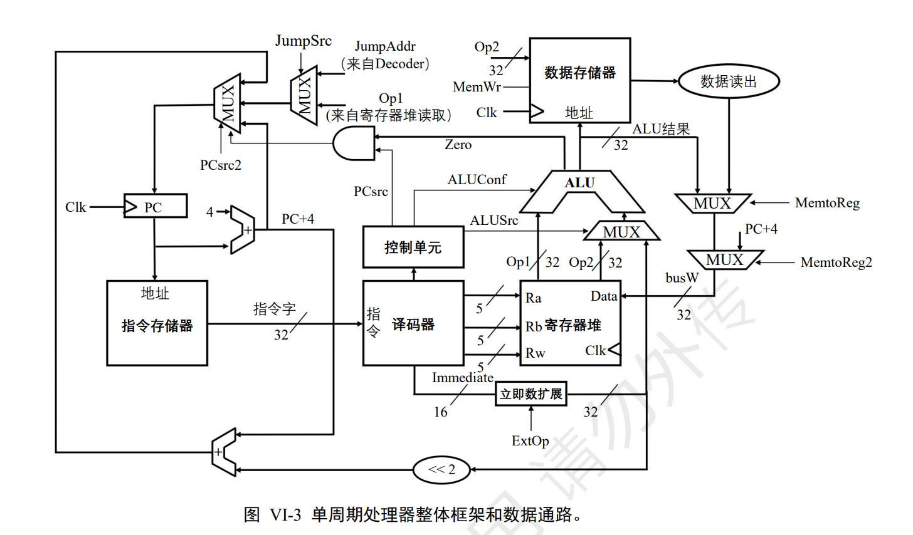

多周期：


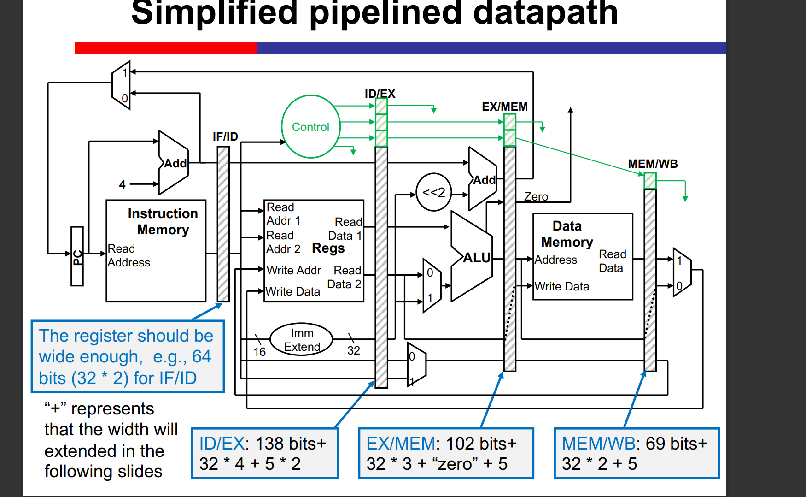


### 单周期到多周期技术路线

#### 五级流水线分级、添加指令与控制信号生成

这里我们的Branch和Jump等指令都是在ID阶段完成提前跳转，并在此基础上实现的冒险处理

1. 添加五级间寄存器

2. 添加之前没有的指令：粗体

   全指令集：

   R型: add, addu, sub, subu, and, or, xor, nor, andi, sll, srl,sra, slt, sltu, jr， **jalr,  **

   I型：lw, sw, lui,addi,addiu, slti, sltiu, beq, **bne, blez, bgtz, bltz**

   J型：j, jal

   nop(应该是不用管？)

   **bgtz**: 1.改了control单元的控制信号 2.ALU中需要新的代码

   bgtz的opcode：000111

3. 分成`IF|ID|EX|MEM|WB`五个阶段，并加入四组分隔寄存器：`IF_ID, ID_EX, EX_MEM, MEM_WB` ,改变各个单元的输入来源，在`CPU.v`中将各个模块的输入信号改为来源于寄存器：

   IF阶段： instructionMemory->IF_ID寄存器存储，更新PC+=4

   ID阶段:  添加Branch专门计算判断单元， 生成control信号和ALU_control信号，存入ID_EX，取出两个要进行操作的数（rs/rt/Imm)

   EX阶段：按控制信号ALU进行计算

   MEM阶段：按控制信号读取/写入信号 data_memory

   WB阶段：register_file写入

   控制信号：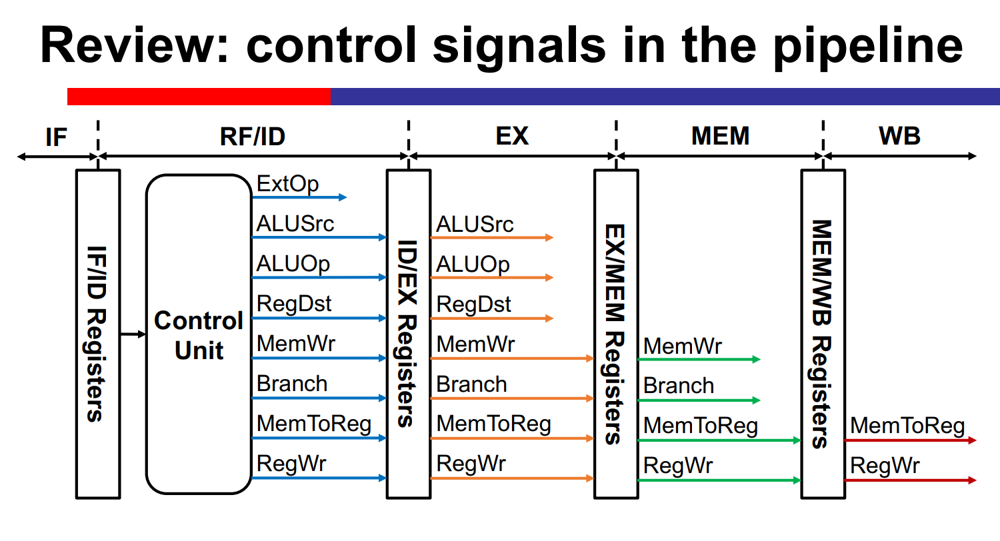

#### 冒险处理

1. **Control-Hazard**: 

   实现stall和flush, Branch类指令和J型指令都在ID阶段完成PC更新，拿到错误的指令需要flush一个出去，我们默认预测beq取不跳转，beq需要判断一次是否是需要跳转的再进行flush

   flush由flush控制，stall由stall信号控制，

   `flush`: beq类和j类在遇到需要flush时，将flush从`ID`发到`IF_ID`,对`ID_EX`阶段的flush直接配合stall进行，使用相同的生成条件

   `stall`:用于`load-use`和`*-beq`

   ```verilog
   	assign flush_IFID = (ID_IsJump | ID_Branch)&(stall_IFID == 0);
   	assign stall_IFID = (ID_Branch &&
   				 ((  EX_RegWrite && (EX_rd == IF_ID_Instruction[25:21] || EX_rd == IF_ID_Instruction[20:16]) )						// *-beq?
   				 || (MEM_MemRead && (MEM_rd == IF_ID_Instruction[25:21] || MEM_rd == IF_ID_Instruction[20:16])))					// lw-*-beq?
   				 || (EX_MemRead && (EX_rd == IF_ID_Instruction[25:21] || EX_rd == IF_ID_Instruction[20:16]))						// lw-*		这里没有管lw-sw,lw-lw的优化，都让它stall一下
   				 )? 1:0;
   ```

   

2. 加入`Fowarding unit`进行**Data Hazard**处理

   a. 转发到`ID`：`Branch`提前需要的数据，来源： `EX/MEM`, `MEM/WB`不用！因为可以先写后读

   b. 转发到`EX`：`EX/MEM, MEM/WB`

   c.转发到`MEM`  只会来源于`MEM/WB`

   d. beq前一条为R或是lw都需要stall然后转发

   关键代码：

   到ID阶段的转发与ID阶段的判断计算

   ```verilog
       Forwarding_ID BrForwarding(IF_ID_Instruction[25:21], IF_ID_Instruction[20:16], 
   								  MEM_rd, MEM_RegWrite, 
   								  MEM_MemRead, WB_rd, BrForwardingA, BrForwardingB);				// 注意检查
   	assign BrALUData1 = BrForwardingA == 1 ? MEM_ALU_out : 
                         BrForwardingA == 2 ? WB_Databus3 : ID_Databus1;
       assign BrALUData2 = BrForwardingB == 1 ? MEM_ALU_out : 
                         BrForwardingB == 2 ? WB_Databus3 : ID_Databus2;
   	BranchALU BrAlu(IF_ID_Instruction[31:26], BrALUData1, BrALUData2, ID_Branch, Zero);				//这里可以优化，转发2其实是没用的
   ```

   到EX阶段的转发：

   ```verilog
   	Forwarding_EX ALUForward(
   	EX_rs,EX_rt,
       MEM_rd,WB_rd,
       MEM_RegWrite,WB_RegWrite,MEM_MemRead,
   	ALUForward1,ALUForward2
   	);
   
   	// ALUSrc1: 0 Databus1, 1 shamt 移位
   	// ALUSrc2: 0 Databus2, 1:LU_out 扩展后立即数
   	// ALUForward： 2从EX_MEM转发，1从MEM_WB转发
   	assign ALU_in1 = EX_ALUSrc1? {27'h00000, EX_Shamt}: 
   					 (ALUForward1==2)? MEM_ALU_out:
   					 (ALUForward1==1)? WB_Databus3:	EX_Databus1;	
   	assign ALU_in2 = EX_ALUSrc2? EX_LU_out: 
   					 (ALUForward2==2)? MEM_ALU_out:
   					 (ALUForward2==1)? WB_Databus3:	EX_Databus2;
   	ALU alu1(
   		.in1    (ALU_in1    ), 
   		.in2    (ALU_in2    ), 
   		.ALUCtl (EX_ALUCtrl     ), 
   		.Sign   (EX_Sign       ), 
   		.out    (EX_ALU_out    ), 
   		.zero   (nouse_Zero       )
   	);
   ```

   

3. Load-use冒险， 

   在load指令的EX阶段结束，检测到存在`Load-use`冒险(EX_Load& ID_Branch & (寄存器号对应))后，发送`stall`信号到`IF/ID`、`flush`信号到`ID\EX`（use指令停在ID，并利用`stall`设置PC值不变，下一周期也还是这条，并且下一周期EX段没有计算，再下一个周期use指令就会进行EX），`MEM`阶段比较 `EX_MEM.Write_Register == ID/EX(EX/MEM).MemBus_Adress`决定是否转发

   所以IF_ID_stall单元应该比较 (EX要RegWrite & (寄存器号对应ID阶段)）&Load

4. **Structural Hazard:**`RegisterFile`需要改成可以同时支持读写且先读后写,对应的需要生成写入寄存器号控制信号，这里是在ID阶段生成的`ID_rd`(其实这个名字起的不好，会有混淆，但是这个rd是经过RegDst控制MUX-rt, rd选过的)最后到`WB_rd`才进行控制写入

#### 其它改动

1. `Control`单元需要加入信号 `IsJump` 标示是否是跳转型指令然后控制是否flush `IF/ID`

   

2. 做一个外设BCD，在CPU中对sw的目标地址进行判断，如果是在BCD范围(0x40000010)就不对DataMemory做操作，而是把信号发去给BCD（需要在汇编代码中完成二进制数字到BCD的译码），reg存储信号，直接接到数码管管脚

   控制信号[12:0]对应管脚：

   | SEL4 | SEL3 | SEL2 | SEL1 | DP   | G    | F    | E    | D    | C    | B    | A    |
   | ---- | ---- | ---- | ---- | ---- | ---- | ---- | ---- | ---- | ---- | ---- | ---- |
   | Y3   | R1   | P2   | M2   | V3   | W4   | P1   | T5   | U5   | V5   | P5   | N2   |

   

3. 在Datamemory中预先存储好我们的测试数据。（dist数组约定存储在200处）


### 软件实现

1. 这里我们延续使用理论课中的bellman_ford算法汇编代码

2. 直接取出硬件中存储好的测试数据进行计算，然后累加统计dist数组和

3. 取出二进制数字的个位、十位、百位、千位。因为CPU上没做除法，这里利用循环减法进行带余数除法计算：

   ```assembly
   # 16进制转4个寄存器里10进制存储
   # 循环计算余数
   addi $t2, $t0, 0    
   addi $t4, $zero,0
   addi $t3, $zero, 10
   div_loop1:
     sub $t2, $t2, $t3    # 用被除数减去除数
     addi $t4, $t4, 1      #统计除法结果
     bgtz $t2, div_loop1  # 如果结果大于等于 0，继续循环
     beq  $t2, $zero, div_loop1
   add $s0, $t2, $t3    # 余数，如果结果小于 0，则加上除数,s0中是个位
   addi $t4,$t4, -1        # 除法结果
   ```

   

4. 把0~9翻译成BCD控制信号：

   共12位，7:0位上

   0：        0011_1111->  0x3f

   1：        0000_0110	0x06

   2：        0101_1011	0x5b

   3：		0100_1111	0x4f

   4：		0110_0110	0x66

   5：		0110_1101	0x6d

   6：		0111_1101	0x7d

   7：		0000_0111	0x07

   8：		0111_1111	0x7f

   9：		0110_1111	0x6f

   11:8位上：

   个位(s0): 	1000

   十位(s0): 	0100

   百位(s0): 	0010

   千位(s0): 	0001

5. 软件进行BCD显示控制：利用nop指令控制时间，sw指令控制BCD对应外设，循环操作完成显示：

   ```assembly
   print:
   addi $t0, $zero, 1              # t0: count time
   addi $t8, $zero, 30000
   print_loop:
       beq $t0, $t8, final_end
       lui $t9, 0x4000          
       addi $t9, $t9, 0x0010                    # the address for BCD control
       sw $s4 , 0($t9)
       jal wait_func
       sw $s5 , 0($t9)
       jal wait_func
       sw $s6 , 0($t9)
       jal wait_func
       sw $s7 , 0($t9)
       jal wait_func
       j print_loop
       
   wait_func:
       addi $t1, $zero, 1
       addi $t2, $zero, 100
       wait_loop:
           beq $t1, $t2, end_wait_loop
           addi $t1, $t1, 1
           nop
           j wait_loop
       end_wait_loop:
       jr $ra
   
   
   final_end:
       nop
       
   ```

#### 编译

因为InstructionMemory只用了Adress[9:2]来决定是哪个指令，而Mars编译器产生的区别在更高位，所以j到某个指令地址可以直接用编译出来的机器指令


## 测试数据

这里我们直接使用了理论课中的样例进行测试。

示意图：

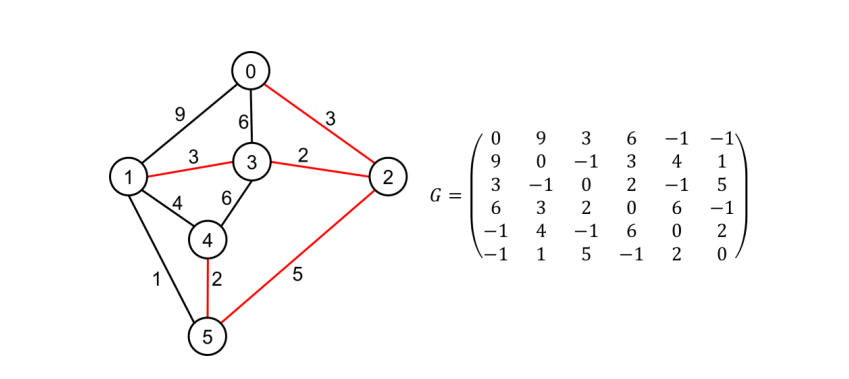


输入为：

6

0 9 3 6 -1 -1

9 0 -1 3 4 1

3 -1 0 2 -1 5

6 3 2 0 6 -1

-1 4 -1 6 0 2

-1 1 5 -1 2 0


答案应该为：

8 3 5 10 8

->34


​	

## 调试与debug

1. lw $a0, 32($$a1)指令中单位是byte，读取地址是 $$a1+32byte,所以寄存器a1中也要以byte为单位，比如我们想lw第64个word（32bit）我们应该设一个256的寄存器

   

2. 原来的汇编代码读入的数据一行有32个，只用6个，Datamemory那里要改成同格式的

   

3. 原来的代码在R-beq有dataHazard时就会出现flush和stall同时为1的冲突：

   ```verilog
   	assign flush_IFID = (ID_IsJump | ID_Branch);
   	assign stall_IFID = (ID_Branch &&
   				 ((  EX_RegWrite && (EX_rd == IF_ID_Instruction[25:21] || EX_rd == IF_ID_Instruction[20:16]) )						// *-beq?
   				 || (MEM_MemRead && (MEM_rd == IF_ID_Instruction[25:21] || MEM_rd == IF_ID_Instruction[20:16])))					// lw-*-beq?
   				 || (EX_MemRead && (EX_rd == IF_ID_Instruction[25:21] || EX_rd == IF_ID_Instruction[20:16]))						// lw-*		这里没有管lw-sw,lw-lw的优化，都让它stall一下
   				 )? 1:0;
   ```

    改成：

   ```verilog
   	assign flush_IFID = (ID_IsJump | ID_Branch)&(stall_IFID == 0);
   	assign stall_IFID = (ID_Branch &&
   				 ((  EX_RegWrite && (EX_rd == IF_ID_Instruction[25:21] || EX_rd == IF_ID_Instruction[20:16]) )						// *-beq?
   				 || (MEM_MemRead && (MEM_rd == IF_ID_Instruction[25:21] || MEM_rd == IF_ID_Instruction[20:16])))					// lw-*-beq?
   				 || (EX_MemRead && (EX_rd == IF_ID_Instruction[25:21] || EX_rd == IF_ID_Instruction[20:16]))						// lw-*		这里没有管lw-sw,lw-lw的优化，都让它stall一下
   				 )? 1:0;
   ```

   从我们的设计思路可以看出，只有R-beq或lw-beq这类会同时产生IF_ID的flush和stall，这个时候我们需要beq留在原地，所以flush失效

   

4. ID阶段更新PC时，计算PC+4要用ID_PC不能直接用IF的PC，这样beq在IDstall的时候PC也不会跑掉了。实际上这段PC更新还是要再考虑考虑，原来的PC是直接在ID阶段的逻辑里算出来的，问题就是ID_PC和现在的PC已经不是一个东西了。要分开讨论用哪个进行更新：

   原来的：

   ```verilog
   	assign ID_PC_plus_4 = ID_PC + 32'd4;
   	wire [32 -1:0] Jump_target;
   	assign Jump_target = {ID_PC_plus_4[31:28], IF_ID_Instruction[25:0], 2'b00};
   	wire [32 -1:0] Branch_target;
   	assign Branch_target = (ID_Branch & Zero)? ID_PC_plus_4 + {ID_LU_out[29:0], 2'b00}: ID_PC_plus_4;
   ```

    更改后：

   ```verilog
   	assign ID_PC_plus_4 = ID_PC + 32'd4;
   	wire [32 -1:0] Jump_target;
   	assign Jump_target = {ID_PC_plus_4[31:28], IF_ID_Instruction[25:0], 2'b00};
   	wire [32 -1:0] Branch_target;
   	assign Branch_target = (ID_Branch & Zero)? ID_PC_plus_4 + {ID_LU_out[29:0], 2'b00}: 
   							(ID_Branch)? ID_PC_plus_4: PC + 32'h4;
   ```

5.  WB阶段要注意jal返回的应该是WB的PC+4；另外jal+jr也会造成数据冒险，但是因为程序中没有这种冒险这里没有处理

   ```
   	assign WB_Databus3 = (WB_MemtoReg == 2'b00)? WB_ALU_out: (WB_MemtoReg == 2'b01)? WB_Memory_Read_Data: WB_PC + 32'd4 ;
   ```

6. `bgtz`和`bltz`要注意不能直接使用>,<号比较，这是无符号比较，要check符号位和是否是0

   ```verilog
    else if(OpCode == 6'h07) begin  // bgtz
                   Zero <= ((data1[31] == 0) & ~(data1 == 0));
               end
               else if(OpCode == 6'h01) begin  // bltz
                   Zero <= (data1[31] == 1 );
   ```

   

7.  之前以为直接这样写就已经实现先写后读的寄存器了，

   ```verilog
   	// read data from RF_data as Read_data1 and Read_data2
   	assign Read_data1 = (Read_register1 == 5'b00000)? 32'h00000000: RF_data[Read_register1];
   	assign Read_data2 = (Read_register2 == 5'b00000)? 32'h00000000: RF_data[Read_register2];
   	
   	integer i;
   	// write Wrtie_data to RF_data at clock posedge
   	always @(posedge reset or posedge clk)
   		if (reset)
   			for (i = 1; i < 32; i = i + 1)
   				RF_data[i] <= 32'h00000000;
   		else if (RegWrite && (Write_register != 5'b00000))
   			RF_data[Write_register] <= Write_data;
   
   ```

   但是发现仿真结果里读出来还是写前的结果，反思是因为Dflip-flop这样的存储器读入的是set-up time+clk上升沿瞬间的数据，如果上升沿后改RF下一个寄存器就不会把变化的数据读入了。所以重新用旁路方法完成先写后读：

   

8. 跑Implementation和simulation是两个不同的文件，要通过source里disable和enable只留一个跑。有的时候Implement和simulate会莫名其妙跑失败，重启一下也许就好了

## 资源与时序性能使用

### 资源使用情况

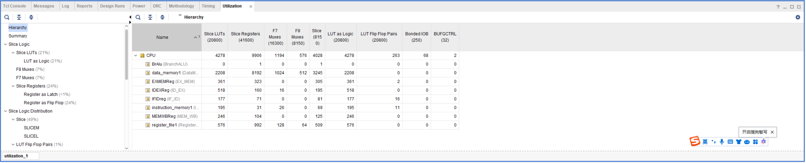

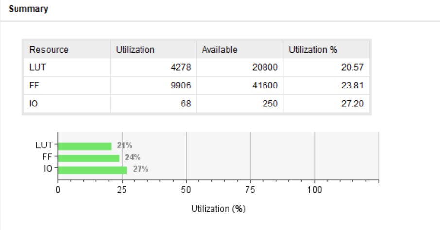


### Schematic

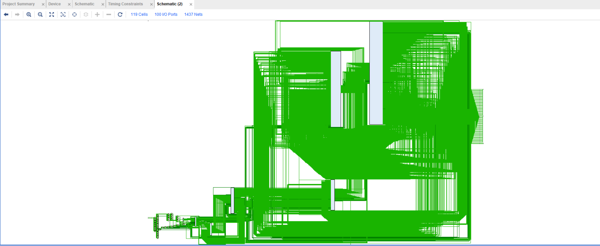


### 时序情况

我设置的时钟约束是9.5ns，是从100ns-20ns-10ns-9.5试出来的比较优的结果，实际使用的是从管脚接来未经过处理的100M信号

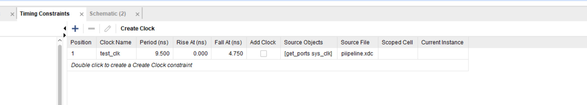

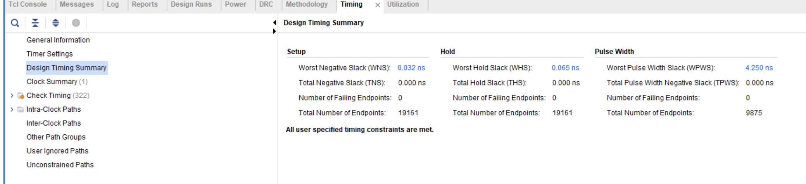


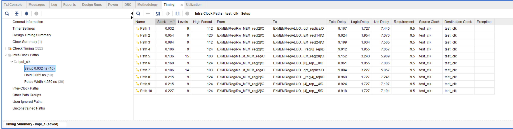


可以看出最短周期大约为9.167ns左右，
$$
最大时钟频率 F=\frac{1}{9.167ns}≈109.1Hz
$$


## 与单周期处理器的对比

理论课中我设计的单周期处理器是这样的：

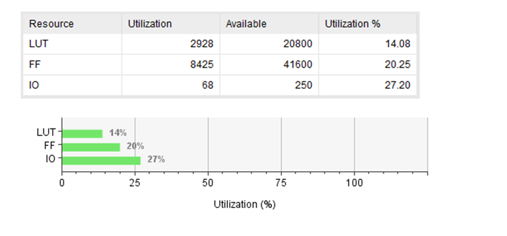

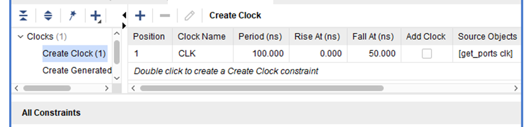

最大时钟频率估测为

Fm = 1/ (clk-WNS) = 1/(100-87.965) = 99MHz

可以发现 流水线处理器显著用到了更多的LUT和FF，其中LUT增长最显著，因为FF消耗虽然流水线中有了更多的级间寄存器，但是实际消耗主要是存储器实现，LUT则是由于增加了各种控制信号、转发处理等消耗量增大

但是有意思的是这个频率增加不明显，甚至在带着外设，未经过优化时Implement结果看流水线的最小周期高达二十余ns，甚至低于单周期，这是一个很奇怪的事情，一方面可能是单周期实现功能有所不同，逻辑更简单，但是似乎影响不应该那么大，另一方面理论课测试的并没有很精确，但是更多的我认为是vivado综合实现过程中设计的问题，我的单周期综合实现所需时间远高于pipeline的综合实现时间。


## 仿真结果

可以看到16~19寄存器中存储的是每位上的十进制数字，20 ~23存储的是译码结果，根据我们的测试数据可以发现 与答案 34 相符，仿真正确

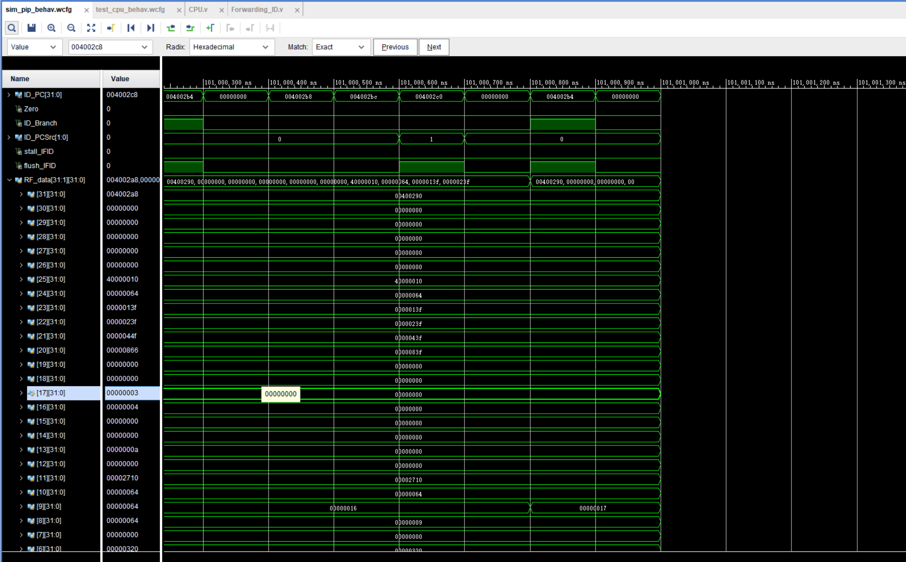


## CPI计算

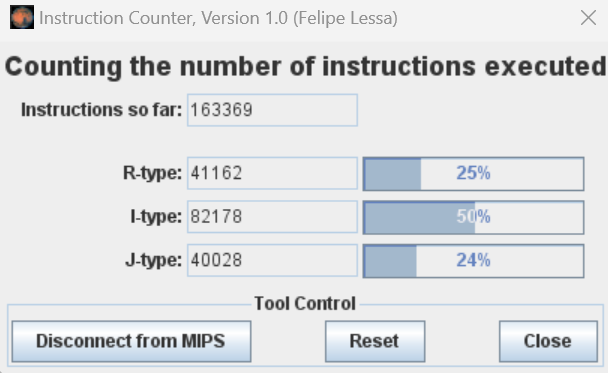


这里为了算CPI我改了程序，让它最后显示是有限循环。这样得到的指令数是163369个

通过仿真可以计算得到流水线使用了24561400ns，由于仿真设置的是100ns周期，所以是245614个cycle完成了计算

​	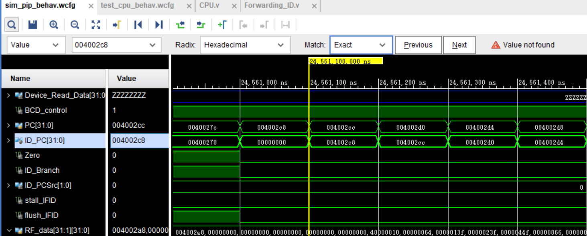


$$
CPI = \frac{245614}{163369}=1.503430883460142
$$
这个CPI偏高是因为在print结果的时候反复利用循环做beq和j导致不断需要flush

## 硬件运行情况

这里我们直接加载到FPGA板上，发现运行正确，印证了我们的时钟频率可以高于100MHz

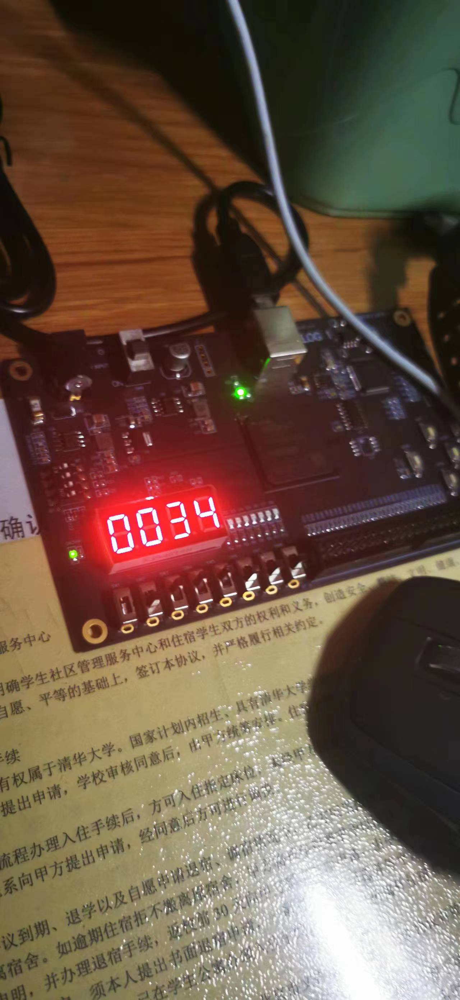

## 总结

​	流水线CPU是一个异常浩大的工程，尤其我先实现的用单周期完成功能，又再改为五级流水线结构。其中光是给变量改名就不知道花了几个小时的时间。

​	心得首先是开始写代码前要先写好计划书，列好设计思路和基础框架，然后按照计划进行施工。

​	其次是细节很重要，每一处命名和对应都要规范，像Instruction, ID_Instruction, PC, ID_PC这样的都很容易用混，每次发现错误，都对这一类错误进行排查（善用查找工具）就可以减少很多调试时间。

​	理论课上学的很多东西其实都不是很牢靠，但是现在经过这样的大作业锻炼感觉踏实了不少，至少流水线的原理和实现过程是可以如数家珍了。

​	最后，虽然要感叹一句其间辛苦不足为他人道也，但是最后成功实现一台自己的五级流水线CPU还是一件很酷很有成就感的事。

## 文件清单

- asm
  - bellman_4pipeline.asm 使用的原始的汇编程序
  - bellman_4pipeline_4CPIcalculate.asm 用于计算CPI进行有限循环的汇编程序
  - generate_instruction.py 通过asm文件生成的mq.txt生成指令代码文件instruction.txt
  - machinecode.txt 对应程序与机器码
  - mq.txt 机器指令
  - instruction.txt 机器码指令代码
- pipeline_codes 所有的约束文件与设计文件
  - ALU.v
  - ALUControl.v
  - BCD_Welog.v
  - BranchALU.v
  - clk_gen.v
  - Control.v
  - CPU.v
  - DataMemory.v
  - debounce.v
  - Device.v
  - EX_MEM.v
  - Forwarding_EX.v
  - Forwarding_ID.v
  - ID_EX.v
  - IF_ID.v
  - InstructionMemory.v
  - MEM_WB.v
  - piipeline.xdc  约束文件
  - RegisterFile.v
  - sim_pip.v 仿真文件
  - test_cpu.v 最终框架设计
- `2021012895_陈泽恺_实验报告.pdf`

​			

